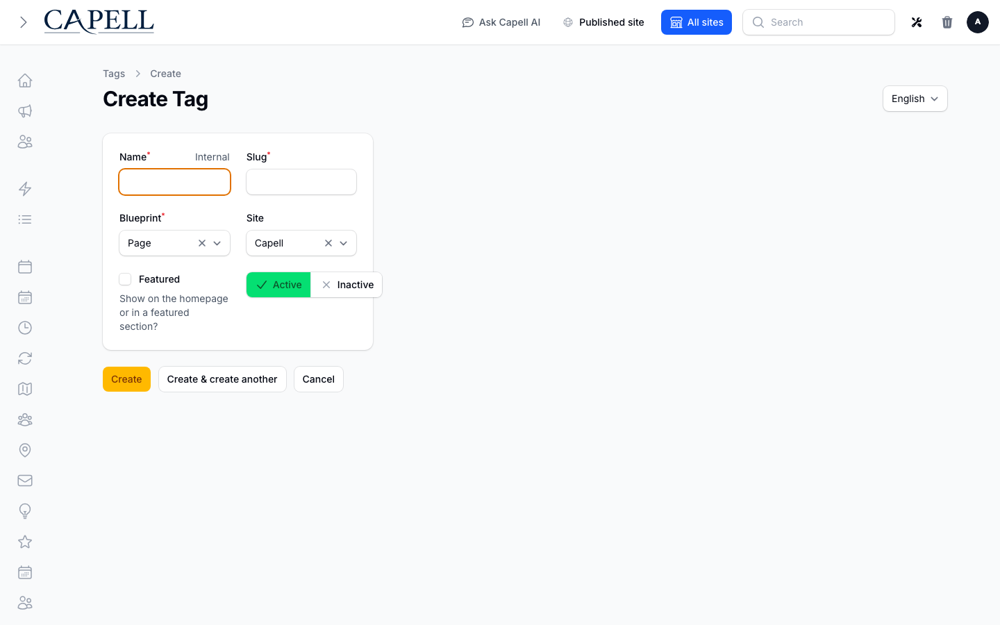

# Tags

<!-- prettier-ignore-start -->

## What This Plugin Adds

Tags is an **Available**, **Schema-owning** Capell package in the **Capell Foundation** product group. It ships as `capell-app/tags` and extends these surfaces: admin, console.

Tags adds site-scoped, multilingual taxonomy records and polymorphic tag assignments for pages and package-owned content.

Admins create and edit tags, assign them to supported content, inspect usage, and merge duplicates from the Tags resource and page actions.

Evidence: [`src/Models/Tag.php`](src/Models/Tag.php), [`src/Models/Taggable.php`](src/Models/Taggable.php), [`src/Models/Concerns/HasTags.php`](src/Models/Concerns/HasTags.php), [`tests/Integration/Models/TagTest.php`](tests/Integration/Models/TagTest.php), [`src/Manifest/TagResourceContribution.php`](src/Manifest/TagResourceContribution.php), [`src/Filament/Extenders/PageTagsPageTableExtender.php`](src/Filament/Extenders/PageTagsPageTableExtender.php), [`src/Actions/ManagePageTagsAction.php`](src/Actions/ManagePageTagsAction.php), [`src/Actions/MergeTagsAction.php`](src/Actions/MergeTagsAction.php).

Status details:

- Status: Available
- Tier: free
- Bundle: foundation
- Composer package: `capell-app/tags`
- Namespace: `Capell\Tags`
- Theme key: not applicable

## Why It Matters

**For developers:** The HasTags concern and focused Actions give content packages a shared taxonomy boundary without duplicating pivot models or assignment logic.

**For teams:** Editors can group content consistently and merge duplicate labels before the taxonomy becomes difficult to browse or filter.

Evidence: [`src/Models/Concerns/HasTags.php`](src/Models/Concerns/HasTags.php), [`src/Actions/ResolveTagBySlugAction.php`](src/Actions/ResolveTagBySlugAction.php), [`src/Actions/ManagePageTagsAction.php`](src/Actions/ManagePageTagsAction.php), [`tests/Integration/Actions/ManagePageTagsActionTest.php`](tests/Integration/Actions/ManagePageTagsActionTest.php), [`docs/overview.admin.md`](docs/overview.admin.md), [`src/Actions/MergeTagsAction.php`](src/Actions/MergeTagsAction.php), [`tests/Integration/Actions/MergeTagsActionTest.php`](tests/Integration/Actions/MergeTagsActionTest.php).

## Screens And Workflow

Screenshot contract: `docs/screenshots.json`.

- Tags admin index (admin, required authentic evidence).
- Create/edit tag form (admin, required evidence).
- Tag relation manager showing tagged pages (admin, supplementary evidence).
- Article or page form using TagsInput (admin, supplementary evidence).
- Tags admin index with admin sidebar menu open (admin, supplementary evidence).

## Technical Shape

- Service providers: `Capell\Tags\Providers\ConsoleServiceProvider`, `Capell\Tags\Providers\TagsServiceProvider`, `Capell\Tags\Providers\AdminServiceProvider`.
- Migrations: `packages/tags/database/migrations/2026_05_10_190872_01_alter_tags_table.php`, `packages/tags/database/migrations/2026_06_04_000001_add_type_site_id_index_to_tags_table.php`, `packages/tags/database/migrations/2026_07_10_000001_add_merged_slug_aliases_to_tags_table.php`, `packages/tags/database/migrations/2026_08_15_000001_add_status_to_tags_table.php`.
- Models: `HasTags`, `Tag`, `Taggable`.
- Filament classes: `ManagePageTagsBulkAction`, `TagsInput`, `PageTagsPageTableExtender`, `CreateTag`, `EditTag`, `ListTags`, `PagesRelationManager`, `TagForm`, `TagsTable`, `TagResource`.
- Policies: `TagPolicy`.
- Actions: `BuildTagCloudAction`, `FindRelatedTaggablesAction`, `InstallTagsPackageAction`, `ManagePageTagsAction`, `MergeTagsAction`, `ResolveTagBySlugAction`.
- Data objects: `RelatedTaggableData`, `ResolvedTagSlugData`, `TagCloudItemData`.
- Command signatures: `capell:tags-install`.
- Manifest action API: `buildTagCloud: Capell\Tags\Actions\BuildTagCloudAction`, `findRelatedTaggables: Capell\Tags\Actions\FindRelatedTaggablesAction`, `install: Capell\Tags\Actions\InstallTagsPackageAction`, `managePageTags: Capell\Tags\Actions\ManagePageTagsAction`, `mergeTags: Capell\Tags\Actions\MergeTagsAction`, `resolveTagBySlug: Capell\Tags\Actions\ResolveTagBySlugAction`.
- Console command classes: `InstallCommand`.
- Manifest contributions: `admin-resource: Capell\Tags\Manifest\TagResourceContribution`, `console-command: Capell\Tags\Manifest\TagsConsoleCommandsContribution`, `health-check: Capell\Tags\Health\TagsHealthCheck`, `migration: Capell\Tags\Manifest\TagsMigrationsContribution`, `model: Capell\Tags\Manifest\TagsModelsContribution`.
- Health checks: `Capell\Tags\Health\TagsHealthCheck`.
- Cache tags: `tags`.

## Data Model

- Required tables: `tags`, `taggables`.
- Models: `HasTags`, `Tag`, `Taggable`.
- Core record references in migrations: `sites via site_id`.
- Migration files: `2026_05_10_190872_01_alter_tags_table.php`, `2026_06_04_000001_add_type_site_id_index_to_tags_table.php`, `2026_07_10_000001_add_merged_slug_aliases_to_tags_table.php`, `2026_08_15_000001_add_status_to_tags_table.php`.
- Migration impact: run host migrations through the package install flow before opening package surfaces.
- Deletion/retention behaviour: migrations declare null-on-delete relationships; no timed pruning or retention schedule is declared in `capell.json`.

## Install Impact

- Required packages: `capell-app/admin`, `capell-app/core`, `capell-app/navigation`.
- Admin navigation: declares `admin-resource: TagResourceContribution`; each Filament page or resource controls its own navigation visibility.
- Admin/editor extensions: none declared.
- Permissions: `ViewAny:Tag`, `View:Tag`, `Create:Tag`, `Update:Tag`, `Delete:Tag`, `DeleteAny:Tag`, `Restore:Tag`, `RestoreAny:Tag`, `ForceDelete:Tag`, `ForceDeleteAny:Tag`, `Replicate:Tag`, `Reorder:Tag`.
- Public routes: none declared.
- Database changes: package migrations are declared.
- Config: no package config files.
- Settings: no package settings declared.
- Queues or schedules: none declared.
- Cache tags: `tags`.
- Commands: `capell:tags-install`.

## Common Pitfalls

- Keep required Capell packages on compatible v4 releases: `capell-app/admin`, `capell-app/core`, `capell-app/navigation`.
- Run migrations before opening package resources or public routes.
- Custom write integrations must preserve invalidation for `tags` cache tags.

## Troubleshooting

| Symptom | Likely cause | Check | Fix |
| --- | --- | --- | --- |
| Package surface is missing after install | Provider or manifest is not loaded | Confirm `capell.json`, package `composer.json`, and provider registration | Reinstall the package, refresh Composer autoload, and clear host caches |
| Admin screen or command fails on missing table | Package migrations have not run | Check the tables listed in `Data Model` | Run host migrations and rerun the focused package test |

## Quick Start

1. Install the package: `composer require capell-app/tags`.
2. Run the required setup: `php artisan capell:tags-install`.
3. Open the package admin surface at `/tags` and confirm Tags is available.

## Next Steps

- [Package docs](docs/README.md)
- [Overview](docs/overview.md)
- [Admin guide](docs/admin-guide.md)
- [Troubleshooting](#troubleshooting)
- [Screenshot contract](docs/screenshots.json)
- [Marketplace assets](docs/assets/marketplace/)
- [Capell content language plan](../../docs/CONTENT_LANGUAGE_PLAN.md)
- [Capell documentation design system](../../docs/DESIGN_SYSTEM.md)
- [Capell and package ERD notes](../../docs/erd/capell-and-package-erds.md)
- Related packages: [Navigation](../navigation/README.md), [Publishing Studio](../publishing-studio/README.md).
- Focused tests: `vendor/bin/pest packages/tags/tests --configuration=phpunit.xml`.

<!-- prettier-ignore-end -->
