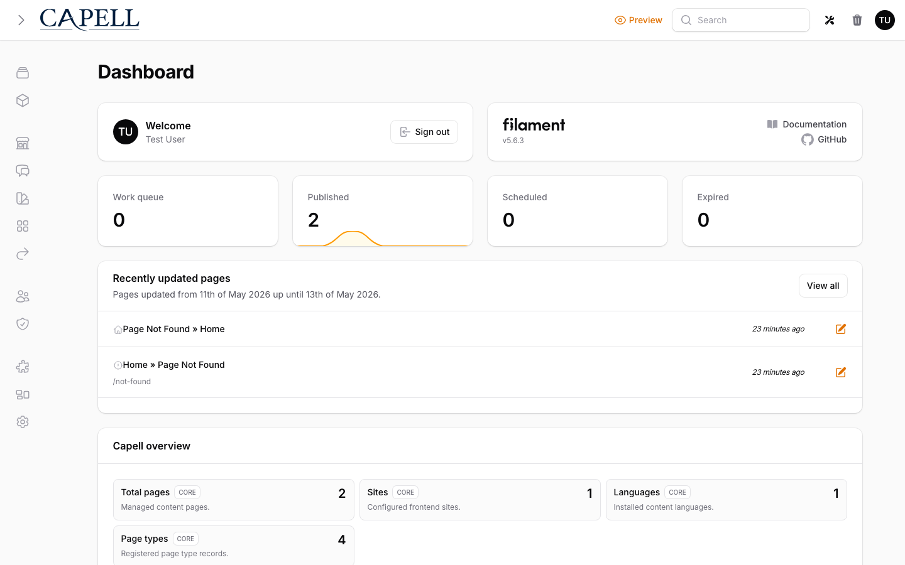
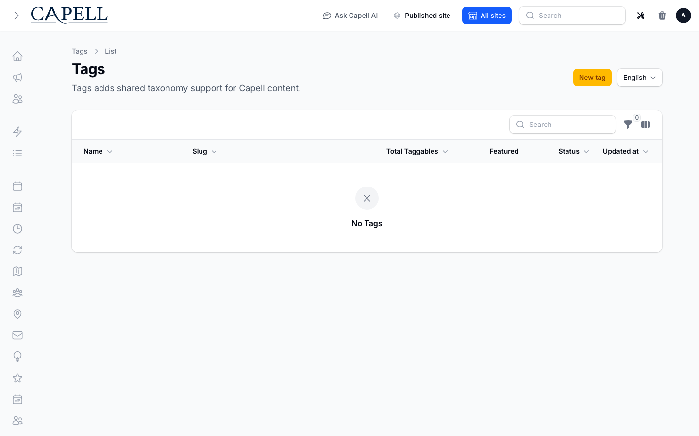

# Using Tags

This guide is for editors and owners who keep content organised with tags. Tags are shared labels you put on pages, articles, and other content so readers and editors can group and find related things. No technical knowledge needed. Every step uses the labels you see on screen.

## Using Tags (editor how-to)

### How to create a tag

1. Go to **Tags** in the admin.
2. Click **New tag**.
3. Enter a **Name**. This is the label people see, for example "Product news".
4. Under **Tag details**, the **Slug** fills in from the name. The slug is the short web-safe version used in links. You can adjust it if you want.
5. Choose a **Type** (for example **Page**, **Article**, or **Content**). The type decides which kind of content the tag belongs with.
6. If you run more than one site, pick the **Site** the tag belongs to.
7. Tick **Featured** if you want this tag highlighted ahead of others.
8. Leave the status set so the tag is enabled, then save.

### How to review your tags and how much they are used

1. Go to **Tags**.
2. The list shows each tag's **Name** and **Slug**.
3. Select **Total Taggables** to open usage grouped by content type and site. You only see records you may view; unavailable records remain counted without exposing their details. Follow a record link where its admin resource offers one. The column shows how many items carry each tag. A high number means the tag is widely used; a low number may mean it can be merged or removed.
4. Use the column controls and filters at the top of the list to narrow by **Site**, **Featured**, or status.

### How to assign tags to a page or article

1. Open the page or article you want to tag in its own editor.
2. Find the tags field on that form.
3. Start typing a tag name. Matching tags appear so you can pick an existing one, which keeps your tags consistent.
4. Add as many tags as fit the content, then save the page or article.

### How to see what content uses a tag

1. Go to **Tags** and open the tag you want to inspect.
2. Look at the **Pages** section on the edit screen. It lists the pages currently tagged with this tag.
3. Review this list before you rename, merge, or delete a tag, so you know what will be affected.

### How to merge duplicate tags

1. Go to **Tags**.
2. Tick the boxes next to the duplicate tags you want to combine (for example "news" and "News").
3. Choose **Merge tags** from the actions at the top of the list.
4. In the dialog, pick the **Target tag**. This is the single tag everything will move into and the one you keep.
5. Continue to **Review merge**. Check the sources, target, affected records, duplicate assignments and preserved slug aliases for each language.
6. Choose **Apply merge**. The source tags are deleted and their assignments move to the target; shared assignments remain a single row. If the selection or underlying tags change, review again before applying.

Merging is permanent. The tags you merged go away and their content now carries the target tag instead. Tags must share the same **Type** and **Site** as the target to be merged together.

### How to remove a tag

1. Go to **Tags** and open the tag, or use the row actions in the list.
2. Check the **Pages** section first to see what is tagged.
3. Choose the delete action. The tag is removed from the content that used it.
4. If the tag is a near-duplicate of another, prefer **Merge tags** instead so you do not lose the grouping.

## Rolling out Tags (for owners)

### Turn on first

- **A small, agreed set of tags.** Decide on a handful of clear tags before editors start applying them. A short consistent list is far more useful than many overlapping ones.

### Add when needed

| Need                                         | What to use                                     |
| -------------------------------------------- | ----------------------------------------------- |
| Group content so readers can browse by topic | Apply consistent **Tags** to pages and articles |
| Highlight a few important tags               | The **Featured** option on a tag                |
| Clean up overlapping or misspelled tags      | **Merge tags** into one canonical tag           |
| Keep tags separate per site                  | Set the **Site** on each tag                    |

### Who does what

| Role            | First useful screen                                                         |
| --------------- | --------------------------------------------------------------------------- |
| Writer / editor | The tags field on a page or article: apply existing tags                    |
| Site owner      | **Tags** list: create tags, watch **Total Taggables**, and merge duplicates |

## Troubleshooting

| What you see                              | What it means                                                     | What to do                                                             |
| ----------------------------------------- | ----------------------------------------------------------------- | ---------------------------------------------------------------------- |
| Two very similar tags in the list         | They are likely duplicates (for example "news" and "News")        | Select both and use **Merge tags**, picking the **Target tag** to keep |
| A tag has a low **Total Taggables** count | Few or no items use it                                            | Consider merging it into a broader tag, or removing it                 |
| You cannot merge two tags                 | They use a different **Type** or **Site** than the target tag     | Only merge tags that share the same **Type** and **Site**              |
| A slug warning appears when saving        | Another tag already uses that **Slug** for the same type and site | Change the **Slug** to something unique                                |
| Content is hard to find on the site       | Tags are inconsistent or missing                                  | Agree a small tag set, apply it consistently, and merge the variants   |
